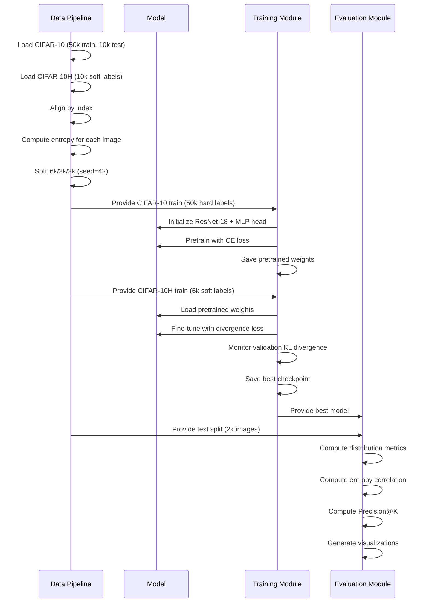
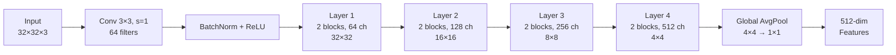

# Design Document: CIFAR-10 Human Disagreement Predictor

## Overview

This document specifies the technical design for a deep learning system that predicts human annotator disagreement on CIFAR-10 images. The system predicts probability distributions over class labels that reflect how approximately 50 human annotators disagree about image classification, rather than predicting a single hard label.

### System Architecture

The system consists of six major phases implemented as modular components:

1. **Data Pipeline**: Downloads, preprocesses, aligns, and splits CIFAR-10 and CIFAR-10H datasets
2. **Model Architecture**: Modified ResNet-18 backbone with MLP prediction head
3. **Loss Functions**: Three divergence-based loss functions (KL, JS, Custom)
4. **Training Protocol**: Two-stage training (pretrain on hard labels, fine-tune on soft labels)
5. **Evaluation Module**: Comprehensive metrics and ablation studies
6. **Robustness & Explainability**: OOD testing, Grad-CAM visualization, failure analysis

### Key Design Decisions

**Two-Stage Training Strategy**: The model first pretrains on CIFAR-10's 50,000 hard-labeled images to learn robust visual features, then fine-tunes on CIFAR-10H's 6,000 soft-labeled images to learn disagreement patterns. This approach leverages the larger hard-label dataset while specializing on the smaller soft-label dataset.

**Modified ResNet-18 for Small Images**: Standard ResNet-18 is designed for 224×224 ImageNet images. For 32×32 CIFAR-10 images, we replace the aggressive initial downsampling (7×7 conv with stride 2 + max pooling) with a gentler 3×3 conv with stride 1, preserving spatial resolution for small images.

**Distribution Matching via Divergence Metrics**: Rather than cross-entropy loss (which assumes a single correct label), we use KL divergence, Jensen-Shannon divergence, and a custom entropy-regularized loss to match the full probability distribution from human annotators.

### Technology Stack

- **Framework**: PyTorch 2.x with torchvision
- **Hardware**: CUDA-capable GPU (recommended) or CPU
- **Data Format**: NumPy arrays (.npy) for CIFAR-10H, PyTorch tensors for training
- **Visualization**: Matplotlib for plots, Grad-CAM for attention maps
- **Metrics**: Custom implementations of KL/JS divergence, scipy for correlations


## Architecture

### System Component Diagram

```mermaid
graph TB
    subgraph "Data Pipeline"
        A[CIFAR-10 Dataset<br/>50k train + 10k test] --> B[Data Loader]
        C[CIFAR-10H Dataset<br/>10k soft labels] --> B
        B --> D[Alignment Module]
        D --> E[Split Module<br/>6k/2k/2k]
        E --> F[Entropy Computer]
        F --> G[Train/Val/Test Splits]
    end
    
    subgraph "Model Architecture"
        H[Input Image<br/>32×32×3] --> I[Modified ResNet-18<br/>Backbone]
        I --> J[512-dim Features]
        J --> K[MLP Head<br/>512→256→10]
        K --> L[Softmax]
        L --> M[Probability Distribution<br/>10 classes]
    end
    
    subgraph "Training Module"
        G --> N[Stage 1: Pretrain<br/>Hard Labels + CE Loss]
        N --> O[Stage 2: Fine-tune<br/>Soft Labels + Divergence Loss]
        O --> P[Best Model Checkpoint]
    end
    
    subgraph "Evaluation Module"
        P --> Q[Distribution Metrics<br/>KL, JS, Cosine]
        P --> R[Entropy Correlation<br/>Pearson, Spearman]
        P --> S[Precision@K<br/>K=100,200,500]
        P --> T[Ablation Studies]
        P --> U[Grad-CAM Visualization]
    end

```

### Data Flow Architecture



### Component Interaction

**Data Pipeline → Training Module**:
- Provides hard-labeled images for pretraining (50,000 images)
- Provides soft-labeled images for fine-tuning (6,000 images)
- Provides validation split for early stopping (2,000 images)

**Training Module → Model**:
- Initializes model architecture
- Performs forward/backward passes
- Updates model weights via optimizer

**Model → Evaluation Module**:
- Generates predicted probability distributions
- Provides feature maps for Grad-CAM
- Outputs entropy predictions

**Data Pipeline → Evaluation Module**:
- Provides test split with ground truth soft labels (2,000 images)
- Provides true entropy values for correlation analysis


## Components and Interfaces

### Phase 1: Data Pipeline Component

#### DataLoader Interface

```python
class CIFAR10HDataset:
    """
    Custom PyTorch Dataset for CIFAR-10H with soft labels.
    
    Attributes:
        images: Tensor of shape (N, 3, 32, 32) - RGB images
        soft_labels: Tensor of shape (N, 10) - probability distributions
        hard_labels: Tensor of shape (N,) - original CIFAR-10 labels
        entropies: Tensor of shape (N,) - Shannon entropy values
    """
    
    def __init__(self, images, soft_labels, hard_labels, entropies, transform=None):
        pass
    
    def __getitem__(self, idx) -> Tuple[Tensor, Tensor, Tensor, float]:
        """Returns (image, soft_label, hard_label, entropy)"""
        pass
    
    def __len__(self) -> int:
        pass
```

#### Alignment Module

**Purpose**: Align CIFAR-10H soft labels with CIFAR-10 test set images by index.

**Input**:
- CIFAR-10 test set: 10,000 images with hard labels
- CIFAR-10H counts: numpy array of shape (10000, 10) with annotator counts
- CIFAR-10H probs: numpy array of shape (10000, 10) with probability distributions

**Output**:
- Aligned dataset: List of (image, soft_label, hard_label) tuples

**Algorithm**:
1. Load CIFAR-10 test set using `torchvision.datasets.CIFAR10(train=False)`
2. Load CIFAR-10H arrays from `.npy` files
3. Verify both have exactly 10,000 entries
4. For each index i in [0, 9999]:
   - Pair CIFAR-10 test image[i] with CIFAR-10H soft_label[i]
   - Store hard_label[i] for reference
5. Validate soft labels sum to 1.0 ± 1e-7

#### Split Module

**Purpose**: Split CIFAR-10H into train/val/test with fixed random seed.

**Configuration**:
- Train size: 6,000 images (60%)
- Validation size: 2,000 images (20%)
- Test size: 2,000 images (20%)
- Random seed: 42

**Implementation**:
```python
from sklearn.model_selection import train_test_split

# First split: 8000 train+val, 2000 test
train_val_indices, test_indices = train_test_split(
    range(10000), test_size=0.2, random_state=42
)

# Second split: 6000 train, 2000 val
train_indices, val_indices = train_test_split(
    train_val_indices, test_size=0.25, random_state=42  # 0.25 * 8000 = 2000
)
```

**Validation**:
- Verify no overlap between splits using set intersection
- Verify total size: len(train) + len(val) + len(test) == 10000

#### Entropy Computation Module

**Purpose**: Compute Shannon entropy for each soft label distribution.

**Formula**:
```
H(p) = -Σ p(y) * log₂(p(y))
```

**Implementation**:
```python
def compute_entropy(probs: np.ndarray, epsilon: float = 1e-7) -> np.ndarray:
    """
    Compute Shannon entropy for probability distributions.
    
    Args:
        probs: Array of shape (N, 10) with probability distributions
        epsilon: Small constant for numerical stability
    
    Returns:
        entropies: Array of shape (N,) with entropy values in bits
    """
    # Add epsilon to avoid log(0)
    probs_safe = probs + epsilon
    # Normalize to ensure sum to 1 after adding epsilon
    probs_safe = probs_safe / probs_safe.sum(axis=1, keepdims=True)
    # Compute entropy in bits (log base 2)
    entropies = -np.sum(probs_safe * np.log2(probs_safe), axis=1)
    return entropies
```

**Validation**:
- Verify all entropy values are in range [0, 3.32] bits
- Maximum entropy for 10 classes: log₂(10) ≈ 3.32 bits

#### Visualization Pipeline

**Histogram of Entropy Distribution**:
```python
def plot_entropy_histogram(entropies: np.ndarray, save_path: str):
    """
    Plot histogram of Shannon entropy values across all images.
    
    Shows distribution of disagreement levels in the dataset.
    """
    plt.figure(figsize=(10, 6))
    plt.hist(entropies, bins=50, edgecolor='black', alpha=0.7)
    plt.xlabel('Shannon Entropy (bits)')
    plt.ylabel('Number of Images')
    plt.title('Distribution of Human Disagreement (CIFAR-10H)')
    plt.axvline(entropies.mean(), color='red', linestyle='--', 
                label=f'Mean: {entropies.mean():.2f}')
    plt.legend()
    plt.grid(alpha=0.3)
    plt.savefig(save_path, dpi=300, bbox_inches='tight')
```

**Per-Class Entropy Distribution**:
```python
def plot_per_class_entropy(entropies: np.ndarray, hard_labels: np.ndarray, 
                           class_names: List[str], save_path: str):
    """
    Plot box plots showing entropy distribution for each class.
    
    Reveals which classes have more annotator disagreement.
    """
    plt.figure(figsize=(12, 6))
    data_by_class = [entropies[hard_labels == i] for i in range(10)]
    plt.boxplot(data_by_class, labels=class_names)
    plt.xlabel('Class')
    plt.ylabel('Shannon Entropy (bits)')
    plt.title('Human Disagreement by Class')
    plt.xticks(rotation=45)
    plt.grid(alpha=0.3)
    plt.savefig(save_path, dpi=300, bbox_inches='tight')
```

**Example Image Grid**:
```python
def plot_example_grid(images: np.ndarray, entropies: np.ndarray, 
                      soft_labels: np.ndarray, save_path: str):
    """
    Display grid of low/medium/high entropy images with their distributions.
    
    Shows 3 rows (low/medium/high entropy) × 5 columns = 15 images.
    """
    # Select images at 10th, 50th, 90th percentiles
    low_idx = np.argsort(entropies)[:5]
    med_idx = np.argsort(np.abs(entropies - np.median(entropies)))[:5]
    high_idx = np.argsort(entropies)[-5:]
    
    fig, axes = plt.subplots(3, 5, figsize=(15, 9))
    # Plot images and bar charts for each category
    # ... implementation details
```


### Phase 2: Model Architecture Component

#### Modified ResNet-18 Backbone

**Standard ResNet-18 Architecture**:
- Initial: 7×7 conv, stride 2, 64 filters → MaxPool 3×3, stride 2
- Layer 1: 2 residual blocks, 64 filters
- Layer 2: 2 residual blocks, 128 filters, stride 2
- Layer 3: 2 residual blocks, 256 filters, stride 2
- Layer 4: 2 residual blocks, 512 filters, stride 2
- Global Average Pool → 512-dim features

**Modifications for 32×32 Images**:

The standard ResNet-18 initial layers reduce spatial dimensions aggressively (224×224 → 56×56 → 28×28), which is inappropriate for 32×32 CIFAR-10 images. We modify:

1. **Replace initial 7×7 conv (stride 2)** with **3×3 conv (stride 1)**:
   - Preserves spatial resolution: 32×32 → 32×32 instead of 32×32 → 16×16
   - Maintains 64 output channels
   
2. **Remove initial MaxPool layer**:
   - Prevents further downsampling
   - Keeps spatial dimensions at 32×32 entering Layer 1

**Modified Architecture Diagram**:



**Implementation**:
```python
import torch.nn as nn
from torchvision.models import resnet18

def create_modified_resnet18() -> nn.Module:
    """
    Create ResNet-18 modified for 32×32 CIFAR-10 images.
    
    Returns:
        Backbone model outputting 512-dimensional features
    """
    model = resnet18(pretrained=False)
    
    # Replace initial 7×7 conv with 3×3 conv
    model.conv1 = nn.Conv2d(3, 64, kernel_size=3, stride=1, 
                            padding=1, bias=False)
    
    # Remove max pooling layer
    model.maxpool = nn.Identity()
    
    # Remove final fully connected layer (we'll add custom head)
    model.fc = nn.Identity()
    
    return model
```

**Feature Dimensions**:
- Input: (batch_size, 3, 32, 32)
- After conv1: (batch_size, 64, 32, 32)
- After layer1: (batch_size, 64, 32, 32)
- After layer2: (batch_size, 128, 16, 16)
- After layer3: (batch_size, 256, 8, 8)
- After layer4: (batch_size, 512, 4, 4)
- After avgpool: (batch_size, 512, 1, 1)
- Output: (batch_size, 512)

#### MLP Prediction Head

**Architecture**:
```
Input (512-dim) → Linear(512, 256) → ReLU → Linear(256, 10) → Softmax
```

**Design Rationale**:
- **Two-layer MLP**: Provides non-linear transformation capacity to map visual features to disagreement distributions
- **Hidden dimension 256**: Balances expressiveness with parameter efficiency
- **ReLU activation**: Standard choice for hidden layers, prevents vanishing gradients
- **Softmax output**: Ensures output is a valid probability distribution (sums to 1)

**Implementation**:
```python
class DisagreementPredictionHead(nn.Module):
    """
    MLP head that predicts probability distributions over 10 classes.
    """
    
    def __init__(self, input_dim: int = 512, hidden_dim: int = 256, 
                 num_classes: int = 10):
        super().__init__()
        self.fc1 = nn.Linear(input_dim, hidden_dim)
        self.relu = nn.ReLU()
        self.fc2 = nn.Linear(hidden_dim, num_classes)
        self.softmax = nn.Softmax(dim=1)
    
    def forward(self, features: torch.Tensor) -> torch.Tensor:
        """
        Args:
            features: Tensor of shape (batch_size, 512)
        
        Returns:
            probs: Tensor of shape (batch_size, 10) with probability distributions
        """
        x = self.fc1(features)
        x = self.relu(x)
        logits = self.fc2(x)
        probs = self.softmax(logits)
        return probs
```

#### Complete Model

**Full Architecture**:
```python
class DisagreementPredictor(nn.Module):
    """
    Complete model: Modified ResNet-18 backbone + MLP prediction head.
    """
    
    def __init__(self):
        super().__init__()
        self.backbone = create_modified_resnet18()
        self.head = DisagreementPredictionHead(
            input_dim=512, hidden_dim=256, num_classes=10
        )
    
    def forward(self, x: torch.Tensor) -> torch.Tensor:
        """
        Args:
            x: Input images of shape (batch_size, 3, 32, 32)
        
        Returns:
            probs: Predicted probability distributions of shape (batch_size, 10)
        """
        features = self.backbone(x)
        probs = self.head(features)
        return probs
    
    def get_features(self, x: torch.Tensor) -> torch.Tensor:
        """Extract 512-dim features for analysis."""
        return self.backbone(x)
```

**Parameter Count**:
- ResNet-18 backbone: ~11M parameters
- MLP head: 512×256 + 256×10 = 133,632 parameters
- Total: ~11.13M parameters


### Phase 3: Loss Functions Component

#### KL Divergence Loss

**Mathematical Definition**:
```
KL(p || q) = Σ p(y) * log(p(y) / q(y))
```

Where:
- p(y): True annotator distribution (target)
- q(y): Predicted distribution (model output)

**Properties**:
- Non-symmetric: KL(p || q) ≠ KL(q || p)
- Non-negative: KL(p || q) ≥ 0
- Zero iff p = q
- Unbounded: can be arbitrarily large

**Implementation**:
```python
def kl_divergence_loss(pred_probs: torch.Tensor, target_probs: torch.Tensor, 
                       epsilon: float = 1e-7) -> torch.Tensor:
    """
    Compute KL divergence loss: KL(target || pred).
    
    Args:
        pred_probs: Predicted distributions, shape (batch_size, num_classes)
        target_probs: Target distributions, shape (batch_size, num_classes)
        epsilon: Small constant for numerical stability
    
    Returns:
        loss: Scalar tensor with mean KL divergence across batch
    """
    # Add epsilon to prevent log(0) and division by zero
    pred_probs = pred_probs + epsilon
    target_probs = target_probs + epsilon
    
    # Normalize to ensure valid probability distributions
    pred_probs = pred_probs / pred_probs.sum(dim=1, keepdim=True)
    target_probs = target_probs / target_probs.sum(dim=1, keepdim=True)
    
    # Compute KL divergence
    kl = target_probs * torch.log(target_probs / pred_probs)
    kl = kl.sum(dim=1)  # Sum over classes
    
    return kl.mean()  # Mean over batch
```

**Numerical Stability Considerations**:
- Add epsilon before logarithm to prevent log(0) = -∞
- Add epsilon before division to prevent division by zero
- Renormalize after adding epsilon to maintain valid distributions
- Use epsilon = 1e-7 as specified in requirements

**Alternative: PyTorch Built-in**:
```python
# PyTorch provides nn.KLDivLoss, but requires log-probabilities as input
criterion = nn.KLDivLoss(reduction='batchmean')
loss = criterion(torch.log(pred_probs + epsilon), target_probs)
```

#### Jensen-Shannon Divergence Loss

**Mathematical Definition**:
```
JS(p || q) = 0.5 * KL(p || m) + 0.5 * KL(q || m)
where m = 0.5 * (p + q)
```

**Properties**:
- Symmetric: JS(p || q) = JS(q || p)
- Bounded: 0 ≤ JS(p || q) ≤ log(2) ≈ 0.693 (for base e) or 1 (for base 2)
- Square root of JS is a valid distance metric
- Smoother gradients than KL divergence

**Implementation**:
```python
def js_divergence_loss(pred_probs: torch.Tensor, target_probs: torch.Tensor,
                       epsilon: float = 1e-7) -> torch.Tensor:
    """
    Compute Jensen-Shannon divergence loss.
    
    Args:
        pred_probs: Predicted distributions, shape (batch_size, num_classes)
        target_probs: Target distributions, shape (batch_size, num_classes)
        epsilon: Small constant for numerical stability
    
    Returns:
        loss: Scalar tensor with mean JS divergence across batch
    """
    # Add epsilon and normalize
    pred_probs = pred_probs + epsilon
    target_probs = target_probs + epsilon
    pred_probs = pred_probs / pred_probs.sum(dim=1, keepdim=True)
    target_probs = target_probs / target_probs.sum(dim=1, keepdim=True)
    
    # Compute mixture distribution
    m = 0.5 * (pred_probs + target_probs)
    
    # Compute KL(target || m) and KL(pred || m)
    kl_target_m = target_probs * torch.log(target_probs / m)
    kl_pred_m = pred_probs * torch.log(pred_probs / m)
    
    # Sum over classes
    kl_target_m = kl_target_m.sum(dim=1)
    kl_pred_m = kl_pred_m.sum(dim=1)
    
    # Compute JS divergence
    js = 0.5 * kl_target_m + 0.5 * kl_pred_m
    
    return js.mean()  # Mean over batch
```

**Why JS Divergence?**:
- Symmetric measure treats prediction and target equally
- Bounded range provides more stable gradients
- Better behaved when distributions have non-overlapping support

#### Custom Entropy-Regularized Loss

**Mathematical Definition**:
```
L_custom = KL(p || q) + λ * |H(p) - H(q)|
```

Where:
- KL(p || q): Distribution matching term
- H(p): Shannon entropy of target distribution
- H(q): Shannon entropy of predicted distribution
- λ = 0.1: Regularization weight

**Design Rationale**:
- **Distribution matching (KL term)**: Ensures predicted distribution matches annotator distribution
- **Entropy penalty (|H(p) - H(q)| term)**: Explicitly encourages model to predict correct disagreement level
- **Absolute difference**: Penalizes both over-confident (H(q) < H(p)) and under-confident (H(q) > H(p)) predictions
- **Weight λ = 0.1**: Balances distribution matching (primary) with entropy matching (secondary)

**Implementation**:
```python
def compute_entropy(probs: torch.Tensor, epsilon: float = 1e-7) -> torch.Tensor:
    """
    Compute Shannon entropy for probability distributions.
    
    Args:
        probs: Probability distributions, shape (batch_size, num_classes)
        epsilon: Small constant for numerical stability
    
    Returns:
        entropy: Tensor of shape (batch_size,) with entropy values
    """
    probs = probs + epsilon
    probs = probs / probs.sum(dim=1, keepdim=True)
    entropy = -(probs * torch.log2(probs)).sum(dim=1)
    return entropy

def custom_entropy_regularized_loss(pred_probs: torch.Tensor, 
                                    target_probs: torch.Tensor,
                                    lambda_weight: float = 0.1,
                                    epsilon: float = 1e-7) -> torch.Tensor:
    """
    Compute custom loss: KL(p || q) + λ * |H(p) - H(q)|.
    
    Args:
        pred_probs: Predicted distributions, shape (batch_size, num_classes)
        target_probs: Target distributions, shape (batch_size, num_classes)
        lambda_weight: Weight for entropy penalty term (default: 0.1)
        epsilon: Small constant for numerical stability
    
    Returns:
        loss: Scalar tensor with mean loss across batch
    """
    # Compute KL divergence term
    kl_loss = kl_divergence_loss(pred_probs, target_probs, epsilon)
    
    # Compute entropy for both distributions
    target_entropy = compute_entropy(target_probs, epsilon)
    pred_entropy = compute_entropy(pred_probs, epsilon)
    
    # Compute entropy penalty
    entropy_penalty = torch.abs(target_entropy - pred_entropy).mean()
    
    # Combine terms
    total_loss = kl_loss + lambda_weight * entropy_penalty
    
    return total_loss
```

**Hyperparameter Justification**:
- λ = 0.1 chosen to make entropy penalty ~10% of total loss
- Prevents entropy term from dominating distribution matching
- Can be tuned as hyperparameter in ablation studies


### Phase 4: Training Protocol Component

#### Two-Stage Training Strategy

**Stage 1: Pretraining on Hard Labels**

**Purpose**: Learn robust visual features from large dataset before specializing on soft labels.

**Configuration**:
- Dataset: CIFAR-10 training set (50,000 images)
- Labels: Hard labels (one-hot encoded)
- Loss: Cross-entropy loss
- Optimizer: AdamW with lr=1e-3
- Batch size: 128
- Epochs: 100 (or until convergence)
- Augmentation: RandomHorizontalFlip + RandomCrop(32, padding=4)

**Implementation**:
```python
def pretrain_on_hard_labels(model: nn.Module, train_loader: DataLoader,
                            num_epochs: int = 100, device: str = 'cuda'):
    """
    Pretrain model on CIFAR-10 hard labels.
    
    Args:
        model: DisagreementPredictor model
        train_loader: DataLoader for CIFAR-10 training set
        num_epochs: Number of training epochs
        device: 'cuda' or 'cpu'
    
    Returns:
        model: Pretrained model
        history: Training history dict
    """
    model = model.to(device)
    optimizer = torch.optim.AdamW(model.parameters(), lr=1e-3, weight_decay=1e-4)
    criterion = nn.CrossEntropyLoss()
    scheduler = torch.optim.lr_scheduler.CosineAnnealingLR(optimizer, T_max=num_epochs)
    
    history = {'train_loss': [], 'train_acc': []}
    
    for epoch in range(num_epochs):
        model.train()
        epoch_loss = 0.0
        correct = 0
        total = 0
        
        for images, labels in train_loader:
            images, labels = images.to(device), labels.to(device)
            
            # Forward pass
            outputs = model(images)
            loss = criterion(outputs, labels)
            
            # Backward pass
            optimizer.zero_grad()
            loss.backward()
            optimizer.step()
            
            # Track metrics
            epoch_loss += loss.item()
            _, predicted = outputs.max(1)
            total += labels.size(0)
            correct += predicted.eq(labels).sum().item()
        
        scheduler.step()
        
        # Log metrics
        avg_loss = epoch_loss / len(train_loader)
        accuracy = 100.0 * correct / total
        history['train_loss'].append(avg_loss)
        history['train_acc'].append(accuracy)
        
        print(f"Epoch {epoch+1}/{num_epochs} - Loss: {avg_loss:.4f}, Acc: {accuracy:.2f}%")
    
    return model, history
```

**Stage 2: Fine-tuning on Soft Labels**

**Purpose**: Specialize model to predict human disagreement distributions.

**Configuration**:
- Dataset: CIFAR-10H training split (6,000 images)
- Labels: Soft labels (probability distributions)
- Loss: KL divergence / JS divergence / Custom loss (train 3 models)
- Optimizer: AdamW with lr=1e-4 (10× lower than pretraining)
- Batch size: 64 (smaller due to limited data)
- Epochs: 50 (with early stopping)
- Augmentation: RandomHorizontalFlip + RandomCrop(32, padding=4)
- Early stopping: Monitor validation KL divergence, patience=10

**Implementation**:
```python
def finetune_on_soft_labels(model: nn.Module, train_loader: DataLoader,
                            val_loader: DataLoader, loss_fn: callable,
                            num_epochs: int = 50, device: str = 'cuda'):
    """
    Fine-tune pretrained model on CIFAR-10H soft labels.
    
    Args:
        model: Pretrained DisagreementPredictor model
        train_loader: DataLoader for CIFAR-10H training split
        val_loader: DataLoader for CIFAR-10H validation split
        loss_fn: Loss function (kl_divergence_loss, js_divergence_loss, or custom)
        num_epochs: Maximum number of training epochs
        device: 'cuda' or 'cpu'
    
    Returns:
        model: Fine-tuned model
        history: Training history dict
    """
    model = model.to(device)
    optimizer = torch.optim.AdamW(model.parameters(), lr=1e-4, weight_decay=1e-4)
    
    history = {
        'train_loss': [], 'val_loss': [], 'val_kl': [], 'val_js': []
    }
    
    best_val_kl = float('inf')
    patience_counter = 0
    patience = 10
    
    for epoch in range(num_epochs):
        # Training phase
        model.train()
        train_loss = 0.0
        
        for images, soft_labels, _, _ in train_loader:
            images = images.to(device)
            soft_labels = soft_labels.to(device)
            
            # Forward pass
            pred_probs = model(images)
            loss = loss_fn(pred_probs, soft_labels)
            
            # Backward pass
            optimizer.zero_grad()
            loss.backward()
            optimizer.step()
            
            train_loss += loss.item()
        
        # Validation phase
        model.eval()
        val_loss = 0.0
        val_kl = 0.0
        val_js = 0.0
        
        with torch.no_grad():
            for images, soft_labels, _, _ in val_loader:
                images = images.to(device)
                soft_labels = soft_labels.to(device)
                
                pred_probs = model(images)
                
                # Compute all metrics
                val_loss += loss_fn(pred_probs, soft_labels).item()
                val_kl += kl_divergence_loss(pred_probs, soft_labels).item()
                val_js += js_divergence_loss(pred_probs, soft_labels).item()
        
        # Average metrics
        train_loss /= len(train_loader)
        val_loss /= len(val_loader)
        val_kl /= len(val_loader)
        val_js /= len(val_loader)
        
        history['train_loss'].append(train_loss)
        history['val_loss'].append(val_loss)
        history['val_kl'].append(val_kl)
        history['val_js'].append(val_js)
        
        print(f"Epoch {epoch+1}/{num_epochs} - Train Loss: {train_loss:.4f}, "
              f"Val KL: {val_kl:.4f}, Val JS: {val_js:.4f}")
        
        # Early stopping based on validation KL divergence
        if val_kl < best_val_kl:
            best_val_kl = val_kl
            patience_counter = 0
            # Save best model
            torch.save(model.state_dict(), 'best_model.pth')
        else:
            patience_counter += 1
            if patience_counter >= patience:
                print(f"Early stopping at epoch {epoch+1}")
                break
    
    # Load best model
    model.load_state_dict(torch.load('best_model.pth'))
    
    return model, history
```

#### Data Augmentation

**Training Augmentation**:
```python
train_transform = transforms.Compose([
    transforms.RandomHorizontalFlip(p=0.5),
    transforms.RandomCrop(32, padding=4),
    transforms.ToTensor(),
    transforms.Normalize(mean=[0.4914, 0.4822, 0.4465],
                        std=[0.2470, 0.2435, 0.2616])
])
```

**Validation/Test (No Augmentation)**:
```python
test_transform = transforms.Compose([
    transforms.ToTensor(),
    transforms.Normalize(mean=[0.4914, 0.4822, 0.4465],
                        std=[0.2470, 0.2435, 0.2616])
])
```

**Normalization Values**: CIFAR-10 dataset statistics (mean and std per channel).

#### Optimizer Configuration

**AdamW Optimizer**:
- **Learning rate (pretraining)**: 1e-3
- **Learning rate (fine-tuning)**: 1e-4 (10× lower for gentle adaptation)
- **Weight decay**: 1e-4 (L2 regularization)
- **Betas**: (0.9, 0.999) (default Adam values)
- **Epsilon**: 1e-8 (numerical stability)

**Why AdamW?**:
- Adaptive learning rates per parameter
- Decoupled weight decay (better than L2 in Adam)
- Well-suited for fine-tuning pretrained models
- Robust to hyperparameter choices

**Learning Rate Schedule (Pretraining)**:
```python
scheduler = torch.optim.lr_scheduler.CosineAnnealingLR(
    optimizer, T_max=num_epochs
)
```
- Gradually reduces learning rate from 1e-3 to ~0
- Helps model converge to better minima

#### Checkpoint Management

**Checkpoint Structure**:
```python
checkpoint = {
    'epoch': epoch,
    'model_state_dict': model.state_dict(),
    'optimizer_state_dict': optimizer.state_dict(),
    'train_loss': train_loss,
    'val_loss': val_loss,
    'val_kl': val_kl,
    'history': history,
    'config': {
        'loss_function': loss_fn_name,
        'learning_rate': lr,
        'batch_size': batch_size,
        'random_seed': 42
    }
}
```

**Naming Convention**:
```
checkpoints/
├── pretrained_resnet18_cifar10.pth
├── finetuned_kl_loss_best.pth
├── finetuned_js_loss_best.pth
└── finetuned_custom_loss_best.pth
```

#### Reproducibility

**Random Seed Management**:
```python
def set_seed(seed: int = 42):
    """Set random seed for reproducibility."""
    random.seed(seed)
    np.random.seed(seed)
    torch.manual_seed(seed)
    torch.cuda.manual_seed_all(seed)
    torch.backends.cudnn.deterministic = True
    torch.backends.cudnn.benchmark = False
```

**Call at start of training**:
```python
set_seed(42)
```


### Phase 5: Evaluation Component

#### Core Metrics

**1. Distribution Matching Metrics**

**KL Divergence**:
```python
def evaluate_kl_divergence(model: nn.Module, test_loader: DataLoader,
                          device: str = 'cuda') -> Dict[str, float]:
    """
    Compute KL divergence between predicted and true distributions.
    
    Returns:
        metrics: Dict with 'mean_kl' and 'std_kl'
    """
    model.eval()
    kl_values = []
    
    with torch.no_grad():
        for images, soft_labels, _, _ in test_loader:
            images = images.to(device)
            soft_labels = soft_labels.to(device)
            
            pred_probs = model(images)
            
            # Compute KL for each sample
            kl = kl_divergence_per_sample(pred_probs, soft_labels)
            kl_values.extend(kl.cpu().numpy())
    
    return {
        'mean_kl': np.mean(kl_values),
        'std_kl': np.std(kl_values)
    }
```

**JS Divergence**:
```python
def evaluate_js_divergence(model: nn.Module, test_loader: DataLoader,
                          device: str = 'cuda') -> Dict[str, float]:
    """
    Compute JS divergence between predicted and true distributions.
    
    Returns:
        metrics: Dict with 'mean_js' and 'std_js'
    """
    # Similar implementation to KL divergence
    # ...
```

**Cosine Similarity**:
```python
def evaluate_cosine_similarity(model: nn.Module, test_loader: DataLoader,
                               device: str = 'cuda') -> Dict[str, float]:
    """
    Compute cosine similarity between predicted and true distributions.
    
    Cosine similarity = (p · q) / (||p|| * ||q||)
    
    Returns:
        metrics: Dict with 'mean_cosine' and 'std_cosine'
    """
    model.eval()
    cosine_values = []
    
    with torch.no_grad():
        for images, soft_labels, _, _ in test_loader:
            images = images.to(device)
            soft_labels = soft_labels.to(device)
            
            pred_probs = model(images)
            
            # Compute cosine similarity
            cosine = F.cosine_similarity(pred_probs, soft_labels, dim=1)
            cosine_values.extend(cosine.cpu().numpy())
    
    return {
        'mean_cosine': np.mean(cosine_values),
        'std_cosine': np.std(cosine_values)
    }
```

**2. Entropy Prediction Quality**

**Correlation Metrics**:
```python
def evaluate_entropy_correlation(model: nn.Module, test_loader: DataLoader,
                                device: str = 'cuda') -> Dict[str, float]:
    """
    Compute correlation between true and predicted entropy values.
    
    Returns:
        metrics: Dict with 'pearson_r', 'pearson_p', 'spearman_r', 'spearman_p'
    """
    from scipy.stats import pearsonr, spearmanr
    
    model.eval()
    true_entropies = []
    pred_entropies = []
    
    with torch.no_grad():
        for images, soft_labels, _, true_entropy in test_loader:
            images = images.to(device)
            
            pred_probs = model(images)
            pred_entropy = compute_entropy(pred_probs)
            
            true_entropies.extend(true_entropy.numpy())
            pred_entropies.extend(pred_entropy.cpu().numpy())
    
    # Compute correlations
    pearson_r, pearson_p = pearsonr(true_entropies, pred_entropies)
    spearman_r, spearman_p = spearmanr(true_entropies, pred_entropies)
    
    return {
        'pearson_r': pearson_r,
        'pearson_p': pearson_p,
        'spearman_r': spearman_r,
        'spearman_p': spearman_p
    }
```

**Scatter Plot Visualization**:
```python
def plot_entropy_correlation(true_entropies: np.ndarray, 
                            pred_entropies: np.ndarray,
                            pearson_r: float, spearman_r: float,
                            save_path: str):
    """
    Create scatter plot of true vs predicted entropy.
    """
    plt.figure(figsize=(8, 8))
    plt.scatter(true_entropies, pred_entropies, alpha=0.5, s=10)
    plt.plot([0, 3.5], [0, 3.5], 'r--', label='Perfect prediction')
    plt.xlabel('True Entropy (bits)')
    plt.ylabel('Predicted Entropy (bits)')
    plt.title(f'Entropy Prediction Quality\n'
              f'Pearson r={pearson_r:.3f}, Spearman ρ={spearman_r:.3f}')
    plt.legend()
    plt.grid(alpha=0.3)
    plt.axis('equal')
    plt.xlim(0, 3.5)
    plt.ylim(0, 3.5)
    plt.savefig(save_path, dpi=300, bbox_inches='tight')
```

**3. Precision at K**

**Purpose**: Evaluate model's ability to identify the most ambiguous images.

**Implementation**:
```python
def evaluate_precision_at_k(model: nn.Module, test_loader: DataLoader,
                           k_values: List[int] = [100, 200, 500],
                           device: str = 'cuda') -> Dict[str, float]:
    """
    Compute Precision@K for identifying ambiguous images.
    
    Precision@K = |top-K by true entropy ∩ top-K by pred entropy| / K
    
    Args:
        model: Trained model
        test_loader: Test data loader
        k_values: List of K values to evaluate
    
    Returns:
        metrics: Dict with 'precision@100', 'precision@200', 'precision@500'
    """
    model.eval()
    true_entropies = []
    pred_entropies = []
    
    with torch.no_grad():
        for images, soft_labels, _, true_entropy in test_loader:
            images = images.to(device)
            
            pred_probs = model(images)
            pred_entropy = compute_entropy(pred_probs)
            
            true_entropies.extend(true_entropy.numpy())
            pred_entropies.extend(pred_entropy.cpu().numpy())
    
    true_entropies = np.array(true_entropies)
    pred_entropies = np.array(pred_entropies)
    
    # Rank images by entropy (descending)
    true_ranking = np.argsort(true_entropies)[::-1]
    pred_ranking = np.argsort(pred_entropies)[::-1]
    
    metrics = {}
    for k in k_values:
        # Get top-K indices
        true_top_k = set(true_ranking[:k])
        pred_top_k = set(pred_ranking[:k])
        
        # Compute overlap
        overlap = len(true_top_k & pred_top_k)
        precision = overlap / k
        
        metrics[f'precision@{k}'] = precision
    
    return metrics
```

#### Ablation Studies

**1. Backbone Initialization Comparison**

**Configurations to Compare**:
- Random initialization (no pretraining)
- CIFAR-10 pretraining (our approach)
- ImageNet pretraining (if available)

**Evaluation**:
```python
def ablation_backbone_initialization():
    """
    Compare different backbone initialization strategies.
    
    Returns:
        results: DataFrame with metrics for each initialization
    """
    results = []
    
    # Random initialization
    model_random = DisagreementPredictor()
    model_random = finetune_on_soft_labels(model_random, ...)
    metrics_random = evaluate_all_metrics(model_random, test_loader)
    results.append({'init': 'random', **metrics_random})
    
    # CIFAR-10 pretraining
    model_cifar10 = DisagreementPredictor()
    model_cifar10, _ = pretrain_on_hard_labels(model_cifar10, cifar10_loader)
    model_cifar10 = finetune_on_soft_labels(model_cifar10, ...)
    metrics_cifar10 = evaluate_all_metrics(model_cifar10, test_loader)
    results.append({'init': 'cifar10', **metrics_cifar10})
    
    # ImageNet pretraining (if available)
    # ...
    
    return pd.DataFrame(results)
```

**2. Loss Function Comparison**

**Configurations to Compare**:
- KL divergence loss
- JS divergence loss
- Custom entropy-regularized loss

**Comparison Table Format**:
```
| Loss Function | Mean KL ↓ | Mean JS ↓ | Cosine Sim ↑ | Pearson r ↑ | Spearman ρ ↑ | P@100 ↑ | P@200 ↑ | P@500 ↑ |
|---------------|-----------|-----------|--------------|-------------|--------------|---------|---------|---------|
| KL Divergence | 0.XXX     | 0.XXX     | 0.XXX        | 0.XXX       | 0.XXX        | 0.XXX   | 0.XXX   | 0.XXX   |
| JS Divergence | 0.XXX     | 0.XXX     | 0.XXX        | 0.XXX       | 0.XXX        | 0.XXX   | 0.XXX   | 0.XXX   |
| Custom Loss   | 0.XXX     | 0.XXX     | 0.XXX        | 0.XXX       | 0.XXX        | 0.XXX   | 0.XXX   | 0.XXX   |
```

**3. Training Strategy Comparison**

**Configurations to Compare**:
- Two-stage: Pretrain on hard labels → Fine-tune on soft labels
- Single-stage: Train only on soft labels (no pretraining)

**4. Prediction Head Architecture Comparison**

**Configurations to Compare**:
- Single linear layer: 512 → 10
- Two-layer MLP: 512 → 256 → 10 (our approach)

#### Per-Class Performance Analysis

**Purpose**: Identify which CIFAR-10 classes have better/worse disagreement prediction.

**Implementation**:
```python
def per_class_analysis(model: nn.Module, test_loader: DataLoader,
                      class_names: List[str], device: str = 'cuda'):
    """
    Compute metrics for each of the 10 CIFAR-10 classes.
    
    Returns:
        results: DataFrame with per-class metrics
    """
    model.eval()
    
    # Initialize storage for each class
    class_metrics = {i: {'kl': [], 'js': [], 'true_entropy': [], 
                         'pred_entropy': []} for i in range(10)}
    
    with torch.no_grad():
        for images, soft_labels, hard_labels, true_entropy in test_loader:
            images = images.to(device)
            soft_labels = soft_labels.to(device)
            
            pred_probs = model(images)
            pred_entropy = compute_entropy(pred_probs)
            
            # Compute metrics per sample
            kl = kl_divergence_per_sample(pred_probs, soft_labels)
            js = js_divergence_per_sample(pred_probs, soft_labels)
            
            # Group by class
            for i in range(len(hard_labels)):
                class_idx = hard_labels[i].item()
                class_metrics[class_idx]['kl'].append(kl[i].item())
                class_metrics[class_idx]['js'].append(js[i].item())
                class_metrics[class_idx]['true_entropy'].append(true_entropy[i].item())
                class_metrics[class_idx]['pred_entropy'].append(pred_entropy[i].item())
    
    # Compute statistics for each class
    results = []
    for class_idx in range(10):
        metrics = class_metrics[class_idx]
        pearson_r, _ = pearsonr(metrics['true_entropy'], metrics['pred_entropy'])
        
        results.append({
            'class': class_names[class_idx],
            'mean_kl': np.mean(metrics['kl']),
            'mean_js': np.mean(metrics['js']),
            'pearson_r': pearson_r,
            'mean_true_entropy': np.mean(metrics['true_entropy'])
        })
    
    return pd.DataFrame(results)
```

**Output Table Format**:
```
| Class      | Mean KL ↓ | Mean JS ↓ | Pearson r ↑ | Mean True Entropy |
|------------|-----------|-----------|-------------|-------------------|
| airplane   | 0.XXX     | 0.XXX     | 0.XXX       | 0.XXX             |
| automobile | 0.XXX     | 0.XXX     | 0.XXX       | 0.XXX             |
| bird       | 0.XXX     | 0.XXX     | 0.XXX       | 0.XXX             |
| ...        | ...       | ...       | ...         | ...               |
```


### Phase 6: Robustness & Explainability Component

#### Out-of-Distribution Corruption Testing

**Purpose**: Evaluate how model predictions degrade under image corruptions.

**Corruption Types**:

1. **Gaussian Noise**:
```python
def add_gaussian_noise(image: torch.Tensor, severity: int) -> torch.Tensor:
    """
    Add Gaussian noise to image.
    
    Args:
        image: Tensor of shape (C, H, W) in range [0, 1]
        severity: 1 (mild), 3 (moderate), 5 (severe)
    
    Returns:
        corrupted: Noisy image
    """
    noise_levels = {1: 0.04, 3: 0.12, 5: 0.20}
    std = noise_levels[severity]
    noise = torch.randn_like(image) * std
    corrupted = image + noise
    return torch.clamp(corrupted, 0, 1)
```

2. **Gaussian Blur**:
```python
def apply_gaussian_blur(image: torch.Tensor, severity: int) -> torch.Tensor:
    """
    Apply Gaussian blur to image.
    
    Args:
        image: Tensor of shape (C, H, W)
        severity: 1 (mild), 3 (moderate), 5 (severe)
    
    Returns:
        blurred: Blurred image
    """
    kernel_sizes = {1: 3, 3: 5, 5: 7}
    sigmas = {1: 0.5, 3: 1.0, 5: 2.0}
    
    kernel_size = kernel_sizes[severity]
    sigma = sigmas[severity]
    
    blur = transforms.GaussianBlur(kernel_size, sigma)
    return blur(image)
```

3. **Contrast Reduction**:
```python
def reduce_contrast(image: torch.Tensor, severity: int) -> torch.Tensor:
    """
    Reduce image contrast.
    
    Args:
        image: Tensor of shape (C, H, W) in range [0, 1]
        severity: 1 (mild), 3 (moderate), 5 (severe)
    
    Returns:
        low_contrast: Image with reduced contrast
    """
    contrast_factors = {1: 0.8, 3: 0.5, 5: 0.3}
    factor = contrast_factors[severity]
    
    mean = image.mean(dim=(1, 2), keepdim=True)
    low_contrast = mean + factor * (image - mean)
    return torch.clamp(low_contrast, 0, 1)
```

**Evaluation Protocol**:
```python
def evaluate_corruption_robustness(model: nn.Module, test_loader: DataLoader,
                                  device: str = 'cuda'):
    """
    Evaluate model robustness to image corruptions.
    
    Returns:
        results: Dict mapping (corruption_type, severity) to entropy change
    """
    model.eval()
    results = {}
    
    corruption_fns = {
        'gaussian_noise': add_gaussian_noise,
        'gaussian_blur': apply_gaussian_blur,
        'contrast_reduction': reduce_contrast
    }
    
    severities = [1, 3, 5]
    
    with torch.no_grad():
        for images, soft_labels, _, _ in test_loader:
            images = images.to(device)
            
            # Get predictions on clean images
            clean_probs = model(images)
            clean_entropy = compute_entropy(clean_probs)
            
            # Test each corruption
            for corruption_name, corruption_fn in corruption_fns.items():
                for severity in severities:
                    # Apply corruption
                    corrupted = torch.stack([
                        corruption_fn(img, severity) for img in images
                    ])
                    corrupted = corrupted.to(device)
                    
                    # Get predictions on corrupted images
                    corrupted_probs = model(corrupted)
                    corrupted_entropy = compute_entropy(corrupted_probs)
                    
                    # Compute entropy change
                    entropy_change = (corrupted_entropy - clean_entropy).abs().mean()
                    
                    key = (corruption_name, severity)
                    if key not in results:
                        results[key] = []
                    results[key].append(entropy_change.item())
    
    # Average across all batches
    for key in results:
        results[key] = np.mean(results[key])
    
    return results
```

**Visualization**:
```python
def plot_corruption_robustness(results: Dict, save_path: str):
    """
    Plot entropy change vs corruption severity for each corruption type.
    """
    fig, axes = plt.subplots(1, 3, figsize=(15, 5))
    
    corruption_types = ['gaussian_noise', 'gaussian_blur', 'contrast_reduction']
    severities = [1, 3, 5]
    
    for idx, corruption_type in enumerate(corruption_types):
        entropy_changes = [results[(corruption_type, s)] for s in severities]
        
        axes[idx].plot(severities, entropy_changes, marker='o', linewidth=2)
        axes[idx].set_xlabel('Severity')
        axes[idx].set_ylabel('Mean Absolute Entropy Change (bits)')
        axes[idx].set_title(corruption_type.replace('_', ' ').title())
        axes[idx].grid(alpha=0.3)
        axes[idx].set_xticks(severities)
    
    plt.tight_layout()
    plt.savefig(save_path, dpi=300, bbox_inches='tight')
```

#### Grad-CAM Visualization

**Purpose**: Visualize which image regions the model attends to when predicting disagreement.

**Implementation**:
```python
class GradCAM:
    """
    Gradient-weighted Class Activation Mapping for CNN visualization.
    """
    
    def __init__(self, model: nn.Module, target_layer: nn.Module):
        """
        Args:
            model: The trained model
            target_layer: The convolutional layer to visualize (e.g., model.backbone.layer4)
        """
        self.model = model
        self.target_layer = target_layer
        self.gradients = None
        self.activations = None
        
        # Register hooks
        self.target_layer.register_forward_hook(self.save_activation)
        self.target_layer.register_backward_hook(self.save_gradient)
    
    def save_activation(self, module, input, output):
        """Hook to save forward pass activations."""
        self.activations = output.detach()
    
    def save_gradient(self, module, grad_input, grad_output):
        """Hook to save backward pass gradients."""
        self.gradients = grad_output[0].detach()
    
    def generate_cam(self, image: torch.Tensor, target_class: int = None) -> np.ndarray:
        """
        Generate Grad-CAM heatmap for an image.
        
        Args:
            image: Input image tensor of shape (1, 3, 32, 32)
            target_class: Class index to visualize (if None, use predicted class)
        
        Returns:
            cam: Heatmap of shape (32, 32) with values in [0, 1]
        """
        self.model.eval()
        
        # Forward pass
        output = self.model(image)
        
        if target_class is None:
            target_class = output.argmax(dim=1).item()
        
        # Backward pass
        self.model.zero_grad()
        output[0, target_class].backward()
        
        # Compute weights (global average pooling of gradients)
        weights = self.gradients.mean(dim=(2, 3), keepdim=True)
        
        # Weighted combination of activation maps
        cam = (weights * self.activations).sum(dim=1, keepdim=True)
        cam = F.relu(cam)  # Apply ReLU to focus on positive contributions
        
        # Normalize to [0, 1]
        cam = cam.squeeze().cpu().numpy()
        cam = (cam - cam.min()) / (cam.max() - cam.min() + 1e-8)
        
        # Resize to input image size
        cam = cv2.resize(cam, (32, 32))
        
        return cam
```

**Visualization Function**:
```python
def visualize_gradcam_comparison(model: nn.Module, test_loader: DataLoader,
                                num_low: int = 5, num_high: int = 5,
                                save_path: str, device: str = 'cuda'):
    """
    Create Grad-CAM visualization comparing low and high entropy images.
    
    Args:
        model: Trained model
        test_loader: Test data loader
        num_low: Number of low-entropy images to visualize
        num_high: Number of high-entropy images to visualize
        save_path: Path to save visualization
    """
    # Select images
    all_images = []
    all_entropies = []
    
    with torch.no_grad():
        for images, _, _, true_entropy in test_loader:
            all_images.append(images)
            all_entropies.append(true_entropy)
    
    all_images = torch.cat(all_images)
    all_entropies = torch.cat(all_entropies)
    
    # Get low and high entropy indices
    low_indices = torch.argsort(all_entropies)[:num_low]
    high_indices = torch.argsort(all_entropies)[-num_high:]
    
    # Initialize Grad-CAM
    gradcam = GradCAM(model, model.backbone.layer4[-1])
    
    # Create visualization grid
    fig, axes = plt.subplots(2, num_low, figsize=(15, 6))
    
    # Low entropy images
    for i, idx in enumerate(low_indices):
        image = all_images[idx:idx+1].to(device)
        cam = gradcam.generate_cam(image)
        
        # Original image
        img_np = all_images[idx].permute(1, 2, 0).numpy()
        img_np = (img_np - img_np.min()) / (img_np.max() - img_np.min())
        
        # Overlay heatmap
        heatmap = cv2.applyColorMap(np.uint8(255 * cam), cv2.COLORMAP_JET)
        heatmap = cv2.cvtColor(heatmap, cv2.COLOR_BGR2RGB) / 255.0
        overlay = 0.6 * img_np + 0.4 * heatmap
        
        axes[0, i].imshow(overlay)
        axes[0, i].set_title(f'Low Entropy\nH={all_entropies[idx]:.2f}')
        axes[0, i].axis('off')
    
    # High entropy images
    for i, idx in enumerate(high_indices):
        image = all_images[idx:idx+1].to(device)
        cam = gradcam.generate_cam(image)
        
        img_np = all_images[idx].permute(1, 2, 0).numpy()
        img_np = (img_np - img_np.min()) / (img_np.max() - img_np.min())
        
        heatmap = cv2.applyColorMap(np.uint8(255 * cam), cv2.COLORMAP_JET)
        heatmap = cv2.cvtColor(heatmap, cv2.COLOR_BGR2RGB) / 255.0
        overlay = 0.6 * img_np + 0.4 * heatmap
        
        axes[1, i].imshow(overlay)
        axes[1, i].set_title(f'High Entropy\nH={all_entropies[idx]:.2f}')
        axes[1, i].axis('off')
    
    plt.tight_layout()
    plt.savefig(save_path, dpi=300, bbox_inches='tight')
```

#### Failure Case Analysis

**Purpose**: Identify and analyze images where the model's predictions differ significantly from human annotations.

**Implementation**:
```python
def analyze_failure_cases(model: nn.Module, test_loader: DataLoader,
                         num_cases: int = 10, device: str = 'cuda'):
    """
    Identify and visualize worst prediction failures.
    
    Args:
        model: Trained model
        test_loader: Test data loader
        num_cases: Number of failure cases to analyze
    
    Returns:
        failure_cases: List of dicts with failure information
    """
    model.eval()
    
    all_data = []
    
    with torch.no_grad():
        for images, soft_labels, hard_labels, true_entropy in test_loader:
            images_device = images.to(device)
            soft_labels_device = soft_labels.to(device)
            
            pred_probs = model(images_device)
            pred_entropy = compute_entropy(pred_probs)
            
            # Compute KL divergence for each sample
            kl = kl_divergence_per_sample(pred_probs, soft_labels_device)
            
            for i in range(len(images)):
                all_data.append({
                    'image': images[i],
                    'true_dist': soft_labels[i],
                    'pred_dist': pred_probs[i].cpu(),
                    'hard_label': hard_labels[i].item(),
                    'true_entropy': true_entropy[i].item(),
                    'pred_entropy': pred_entropy[i].item(),
                    'kl_divergence': kl[i].item()
                })
    
    # Sort by KL divergence (worst first)
    all_data.sort(key=lambda x: x['kl_divergence'], reverse=True)
    
    # Select top failures
    failure_cases = all_data[:num_cases]
    
    return failure_cases
```

**Visualization**:
```python
def visualize_failure_cases(failure_cases: List[Dict], class_names: List[str],
                           save_path: str):
    """
    Create visualization grid for failure cases.
    
    Shows: image, true distribution, predicted distribution, entropies, KL divergence
    """
    num_cases = len(failure_cases)
    fig, axes = plt.subplots(num_cases, 3, figsize=(12, 4 * num_cases))
    
    for i, case in enumerate(failure_cases):
        # Image
        img = case['image'].permute(1, 2, 0).numpy()
        img = (img - img.min()) / (img.max() - img.min())
        axes[i, 0].imshow(img)
        axes[i, 0].set_title(f"Image (Class: {class_names[case['hard_label']]})\n"
                            f"KL={case['kl_divergence']:.3f}")
        axes[i, 0].axis('off')
        
        # True distribution
        axes[i, 1].bar(range(10), case['true_dist'].numpy())
        axes[i, 1].set_title(f"True Distribution\nH={case['true_entropy']:.2f}")
        axes[i, 1].set_xticks(range(10))
        axes[i, 1].set_xticklabels(class_names, rotation=45, ha='right')
        axes[i, 1].set_ylim(0, 1)
        
        # Predicted distribution
        axes[i, 2].bar(range(10), case['pred_dist'].numpy())
        axes[i, 2].set_title(f"Predicted Distribution\nH={case['pred_entropy']:.2f}")
        axes[i, 2].set_xticks(range(10))
        axes[i, 2].set_xticklabels(class_names, rotation=45, ha='right')
        axes[i, 2].set_ylim(0, 1)
    
    plt.tight_layout()
    plt.savefig(save_path, dpi=300, bbox_inches='tight')
```

#### Manual Disagreement Source Categorization

**Purpose**: Understand why humans disagree on certain images.

**Disagreement Categories**:
1. **Ambiguous Identity**: Object genuinely looks like multiple classes
2. **Poor Image Quality**: Low resolution, blur, occlusion
3. **Multi-Object Scene**: Multiple objects present, unclear focus
4. **Boundary Case**: Object at edge of class definition
5. **Other**: Uncategorized reasons

**Implementation**:
```python
def manual_categorization_interface(high_entropy_images: List[Dict],
                                   class_names: List[str]):
    """
    Interactive interface for manually categorizing disagreement sources.
    
    Args:
        high_entropy_images: List of 20-30 highest entropy images
        class_names: CIFAR-10 class names
    
    Returns:
        categorization: Dict mapping image_idx to category
    """
    categories = [
        'ambiguous_identity',
        'poor_image_quality',
        'multi_object_scene',
        'boundary_case',
        'other'
    ]
    
    categorization = {}
    
    for idx, img_data in enumerate(high_entropy_images):
        # Display image and distribution
        plt.figure(figsize=(10, 4))
        
        plt.subplot(1, 2, 1)
        img = img_data['image'].permute(1, 2, 0).numpy()
        img = (img - img.min()) / (img.max() - img.min())
        plt.imshow(img)
        plt.title(f"Image {idx+1}/{len(high_entropy_images)}\n"
                 f"Entropy: {img_data['entropy']:.2f} bits")
        plt.axis('off')
        
        plt.subplot(1, 2, 2)
        plt.bar(range(10), img_data['distribution'].numpy())
        plt.xticks(range(10), class_names, rotation=45, ha='right')
        plt.title('Annotator Distribution')
        plt.ylim(0, 1)
        
        plt.tight_layout()
        plt.show()
        
        # Prompt for category
        print("\nCategories:")
        for i, cat in enumerate(categories):
            print(f"{i+1}. {cat.replace('_', ' ').title()}")
        
        choice = int(input("Select category (1-5): "))
        categorization[idx] = categories[choice - 1]
        
        plt.close()
    
    return categorization
```

**Summary Report**:
```python
def generate_categorization_summary(categorization: Dict) -> pd.DataFrame:
    """
    Generate summary report of disagreement source frequencies.
    
    Returns:
        summary: DataFrame with category counts and percentages
    """
    from collections import Counter
    
    counts = Counter(categorization.values())
    total = len(categorization)
    
    summary = pd.DataFrame([
        {
            'Category': cat.replace('_', ' ').title(),
            'Count': counts[cat],
            'Percentage': 100.0 * counts[cat] / total
        }
        for cat in counts
    ])
    
    return summary.sort_values('Count', ascending=False)
```


## Data Models

### Core Data Structures

**CIFAR10HImage**:
```python
@dataclass
class CIFAR10HImage:
    """
    Single image with associated labels and metadata.
    """
    image: torch.Tensor  # Shape: (3, 32, 32), RGB image
    soft_label: torch.Tensor  # Shape: (10,), probability distribution
    hard_label: int  # Original CIFAR-10 class label (0-9)
    entropy: float  # Shannon entropy of soft_label in bits
    image_index: int  # Index in original CIFAR-10H dataset
```

**DatasetSplit**:
```python
@dataclass
class DatasetSplit:
    """
    Train/validation/test split configuration.
    """
    train_indices: List[int]  # 6,000 indices
    val_indices: List[int]  # 2,000 indices
    test_indices: List[int]  # 2,000 indices
    random_seed: int  # 42
    
    def validate(self):
        """Verify no overlap and correct sizes."""
        assert len(self.train_indices) == 6000
        assert len(self.val_indices) == 2000
        assert len(self.test_indices) == 2000
        
        train_set = set(self.train_indices)
        val_set = set(self.val_indices)
        test_set = set(self.test_indices)
        
        assert len(train_set & val_set) == 0
        assert len(train_set & test_set) == 0
        assert len(val_set & test_set) == 0
```

**ModelCheckpoint**:
```python
@dataclass
class ModelCheckpoint:
    """
    Saved model checkpoint with metadata.
    """
    epoch: int
    model_state_dict: Dict
    optimizer_state_dict: Dict
    train_loss: float
    val_loss: float
    val_kl: float
    config: Dict
    timestamp: str
```

**EvaluationMetrics**:
```python
@dataclass
class EvaluationMetrics:
    """
    Complete evaluation metrics for a model.
    """
    # Distribution matching
    mean_kl: float
    std_kl: float
    mean_js: float
    std_js: float
    mean_cosine: float
    std_cosine: float
    
    # Entropy prediction
    pearson_r: float
    pearson_p: float
    spearman_r: float
    spearman_p: float
    
    # Ranking quality
    precision_at_100: float
    precision_at_200: float
    precision_at_500: float
    
    # Per-class metrics
    per_class_kl: Dict[str, float]
    per_class_js: Dict[str, float]
    per_class_pearson: Dict[str, float]
```

### Configuration Schemas

**DataPipelineConfig**:
```python
@dataclass
class DataPipelineConfig:
    """
    Configuration for data pipeline.
    """
    cifar10_root: str = './data/cifar10'
    cifar10h_counts_path: str = 'cifar-10h-1.0.0/data/cifar10h-counts.npy'
    cifar10h_probs_path: str = 'cifar-10h-1.0.0/data/cifar10h-probs.npy'
    train_size: int = 6000
    val_size: int = 2000
    test_size: int = 2000
    random_seed: int = 42
    epsilon: float = 1e-7
    
    def to_json(self) -> str:
        """Serialize to JSON string."""
        return json.dumps(asdict(self), indent=2)
    
    @classmethod
    def from_json(cls, json_str: str) -> 'DataPipelineConfig':
        """Deserialize from JSON string."""
        data = json.loads(json_str)
        return cls(**data)
```

**ModelConfig**:
```python
@dataclass
class ModelConfig:
    """
    Configuration for model architecture.
    """
    backbone: str = 'resnet18'
    backbone_pretrained: bool = False
    head_hidden_dim: int = 256
    num_classes: int = 10
    
    def to_json(self) -> str:
        return json.dumps(asdict(self), indent=2)
    
    @classmethod
    def from_json(cls, json_str: str) -> 'ModelConfig':
        data = json.loads(json_str)
        return cls(**data)
```

**TrainingConfig**:
```python
@dataclass
class TrainingConfig:
    """
    Configuration for training protocol.
    """
    # Pretraining
    pretrain_lr: float = 1e-3
    pretrain_epochs: int = 100
    pretrain_batch_size: int = 128
    
    # Fine-tuning
    finetune_lr: float = 1e-4
    finetune_epochs: int = 50
    finetune_batch_size: int = 64
    loss_function: str = 'kl'  # 'kl', 'js', or 'custom'
    lambda_entropy: float = 0.1  # For custom loss
    
    # Optimization
    optimizer: str = 'adamw'
    weight_decay: float = 1e-4
    
    # Early stopping
    patience: int = 10
    
    # Augmentation
    use_augmentation: bool = True
    random_flip_prob: float = 0.5
    random_crop_padding: int = 4
    
    # Reproducibility
    random_seed: int = 42
    
    def to_json(self) -> str:
        return json.dumps(asdict(self), indent=2)
    
    @classmethod
    def from_json(cls, json_str: str) -> 'TrainingConfig':
        data = json.loads(json_str)
        return cls(**data)
```


## Correctness Properties

*A property is a characteristic or behavior that should hold true across all valid executions of a system—essentially, a formal statement about what the system should do. Properties serve as the bridge between human-readable specifications and machine-verifiable correctness guarantees.*

### Property Reflection

After analyzing all acceptance criteria, I identified the following properties suitable for property-based testing. Many requirements are infrastructure tests, smoke tests, or example-based tests that are not suitable for PBT. The properties below focus on:

1. **Mathematical correctness**: Normalization, entropy computation, numerical stability
2. **Data integrity**: Split disjointness, pairing preservation
3. **Serialization correctness**: Round-trip properties for configurations
4. **Error handling**: Validation and error reporting

**Redundancy Analysis**:
- Properties 2.1 and 2.2 both test normalization, but 2.2 is more comprehensive (tests the constraint directly)
- Properties 32.3, 33.3, and 34.3 all test round-trip serialization but for different config types - these are distinct and necessary
- Properties 4.1, 4.2, and 4.3 all relate to entropy but test different aspects (correctness, stability, bounds) - all are necessary

### Property 1: Probability Distribution Normalization

*For any* array of non-negative counts, normalizing the counts to create a probability distribution SHALL result in a distribution that sums to 1.0 within tolerance ε=1e-7.

**Validates: Requirements 2.1, 2.2**

**Test Strategy**: Generate random count arrays with varying sizes and value ranges, normalize them, verify sum constraint.

### Property 2: Invalid Distribution Detection

*For any* probability distribution that does not sum to 1.0 within tolerance ε=1e-7, the validation function SHALL raise a ValidationError containing the distribution index.

**Validates: Requirement 2.3**

**Test Strategy**: Generate invalid distributions (sum < 0.99 or sum > 1.01), verify ValidationError is raised with correct index.

### Property 3: Index-Based Alignment Preservation

*For any* pair of datasets with matching indices, aligning them by index SHALL preserve the correspondence such that aligned_dataset[i] contains elements from dataset1[i] and dataset2[i].

**Validates: Requirement 2.4**

**Test Strategy**: Generate mock datasets with known index mappings, align them, verify correspondence is preserved.

### Property 4: Dataset Split Reproducibility

*For any* dataset and fixed random seed, performing the split operation multiple times SHALL produce identical train/val/test index sets.

**Validates: Requirement 3.2**

**Test Strategy**: Run split function twice with seed=42, verify train_indices1 == train_indices2, val_indices1 == val_indices2, test_indices1 == test_indices2.

### Property 5: Dataset Split Disjointness

*For any* dataset split into train/val/test sets, the three sets SHALL be pairwise disjoint (no shared indices).

**Validates: Requirement 3.3**

**Test Strategy**: Generate splits with various random seeds, verify set(train) ∩ set(val) = ∅, set(train) ∩ set(test) = ∅, set(val) ∩ set(test) = ∅.

### Property 6: Paired Data Preservation During Splitting

*For any* dataset of (image, label) pairs, splitting the dataset SHALL preserve the pairing such that if (image_i, label_i) is in the original dataset, then image_i and label_i appear together in exactly one split.

**Validates: Requirement 3.4**

**Test Strategy**: Generate mock paired data with unique identifiers, split, verify pairs remain intact in their assigned split.

### Property 7: Shannon Entropy Correctness

*For any* valid probability distribution p over 10 classes, the computed Shannon entropy SHALL equal -Σ p(y) * log₂(p(y)) within numerical precision.

**Validates: Requirement 4.1**

**Test Strategy**: Generate random probability distributions, compute entropy using implementation, verify against reference implementation.

### Property 8: Entropy Numerical Stability

*For any* probability distribution including zero probabilities, computing Shannon entropy with epsilon=1e-7 SHALL produce finite values (no NaN or Inf).

**Validates: Requirement 4.2**

**Test Strategy**: Generate distributions with zeros, verify entropy computation returns finite float values.

### Property 9: Entropy Bounds

*For any* valid probability distribution over 10 classes, the computed Shannon entropy SHALL be in the range [0, log₂(10)] ≈ [0, 3.32] bits.

**Validates: Requirement 4.3**

**Test Strategy**: Generate random probability distributions, compute entropy, verify 0 ≤ H(p) ≤ 3.32.

### Property 10: Data Pipeline Configuration Round-Trip

*For any* valid DataPipelineConfig object, the round-trip operation parse(serialize(config)) SHALL produce a configuration equivalent to the original.

**Validates: Requirement 32.3**

**Test Strategy**: Generate random DataPipelineConfig objects with varying field values, serialize to JSON, parse back, verify equality.

### Property 11: Data Pipeline Configuration Error Reporting

*For any* invalid JSON configuration (missing required fields, wrong types, invalid values), parsing SHALL raise a descriptive error indicating which field is invalid.

**Validates: Requirement 32.4**

**Test Strategy**: Generate invalid JSON configs (missing fields, wrong types), verify descriptive errors are raised.

### Property 12: Model Configuration Round-Trip

*For any* valid ModelConfig object, the round-trip operation parse(serialize(config)) SHALL produce a configuration equivalent to the original.

**Validates: Requirement 33.3**

**Test Strategy**: Generate random ModelConfig objects, serialize to JSON, parse back, verify equality.

### Property 13: Model Configuration Error Reporting

*For any* invalid model configuration JSON (invalid backbone name, negative dimensions, wrong types), parsing SHALL raise a descriptive error indicating which field is invalid.

**Validates: Requirement 33.4**

**Test Strategy**: Generate invalid model configs, verify descriptive errors are raised.

### Property 14: Training Configuration Round-Trip

*For any* valid TrainingConfig object, the round-trip operation parse(serialize(config)) SHALL produce a configuration equivalent to the original.

**Validates: Requirement 34.3**

**Test Strategy**: Generate random TrainingConfig objects with varying hyperparameters, serialize to JSON, parse back, verify equality.

### Property 15: Training Configuration Error Reporting

*For any* invalid training configuration JSON (negative learning rates, invalid loss function names, wrong types), parsing SHALL raise a descriptive error indicating which hyperparameter is invalid.

**Validates: Requirement 34.4**

**Test Strategy**: Generate invalid training configs, verify descriptive errors are raised.


## Error Handling

### Error Categories

**1. Data Loading Errors**

**FileNotFoundError**:
- Raised when CIFAR-10H .npy files are not found
- Message: "CIFAR-10H data file not found: {path}"
- Recovery: Provide correct file path or download dataset

**DataShapeError**:
- Raised when loaded data has incorrect shape
- Message: "Expected shape {expected}, got {actual}"
- Recovery: Verify data file integrity

**2. Data Validation Errors**

**ValidationError**:
- Raised when soft labels don't sum to 1.0
- Message: "Soft label at index {idx} does not sum to 1.0: sum={sum_value}"
- Recovery: Check data preprocessing pipeline

**EntropyRangeError**:
- Raised when computed entropy is outside valid range
- Message: "Entropy {value} outside valid range [0, 3.32] for image {idx}"
- Recovery: Check probability distribution validity

**3. Configuration Errors**

**ConfigParseError**:
- Raised when JSON configuration is invalid
- Message: "Invalid configuration: {field} - {reason}"
- Recovery: Fix configuration file according to schema

**SchemaValidationError**:
- Raised when configuration doesn't match schema
- Message: "Configuration validation failed: {details}"
- Recovery: Ensure all required fields are present with correct types

**4. Training Errors**

**NumericalInstabilityError**:
- Raised when NaN or Inf values detected during training
- Message: "Numerical instability detected at epoch {epoch}: {details}"
- Recovery: Reduce learning rate, check loss function implementation

**CheckpointLoadError**:
- Raised when model checkpoint cannot be loaded
- Message: "Failed to load checkpoint from {path}: {reason}"
- Recovery: Verify checkpoint file exists and is compatible

### Error Handling Strategy

**Graceful Degradation**:
```python
def load_cifar10h_data(counts_path: str, probs_path: str) -> Tuple[np.ndarray, np.ndarray]:
    """
    Load CIFAR-10H data with error handling.
    
    Raises:
        FileNotFoundError: If data files don't exist
        DataShapeError: If data has incorrect shape
    """
    try:
        counts = np.load(counts_path)
        probs = np.load(probs_path)
    except FileNotFoundError as e:
        raise FileNotFoundError(
            f"CIFAR-10H data file not found: {e.filename}. "
            f"Please download from https://github.com/jcpeterson/cifar-10h"
        )
    
    # Validate shapes
    if counts.shape != (10000, 10):
        raise DataShapeError(
            f"CIFAR-10H counts: expected shape (10000, 10), got {counts.shape}"
        )
    
    if probs.shape != (10000, 10):
        raise DataShapeError(
            f"CIFAR-10H probs: expected shape (10000, 10), got {probs.shape}"
        )
    
    return counts, probs
```

**Validation with Detailed Errors**:
```python
def validate_soft_labels(soft_labels: np.ndarray, epsilon: float = 1e-7) -> None:
    """
    Validate that all soft labels sum to 1.0.
    
    Raises:
        ValidationError: If any distribution doesn't sum to 1.0
    """
    sums = soft_labels.sum(axis=1)
    invalid_indices = np.where(np.abs(sums - 1.0) > epsilon)[0]
    
    if len(invalid_indices) > 0:
        errors = []
        for idx in invalid_indices[:5]:  # Show first 5 errors
            errors.append(f"  Index {idx}: sum={sums[idx]:.10f}")
        
        error_msg = (
            f"Found {len(invalid_indices)} invalid soft label distributions:\n"
            + "\n".join(errors)
        )
        
        if len(invalid_indices) > 5:
            error_msg += f"\n  ... and {len(invalid_indices) - 5} more"
        
        raise ValidationError(error_msg)
```

**Training Stability Checks**:
```python
def check_numerical_stability(loss: torch.Tensor, epoch: int) -> None:
    """
    Check for NaN or Inf values during training.
    
    Raises:
        NumericalInstabilityError: If NaN or Inf detected
    """
    if torch.isnan(loss):
        raise NumericalInstabilityError(
            f"NaN loss detected at epoch {epoch}. "
            f"Try reducing learning rate or checking loss function implementation."
        )
    
    if torch.isinf(loss):
        raise NumericalInstabilityError(
            f"Inf loss detected at epoch {epoch}. "
            f"Check for division by zero or overflow in loss computation."
        )
```

### Logging Strategy

**Log Levels**:
- **DEBUG**: Detailed information for debugging (batch losses, gradient norms)
- **INFO**: General progress information (epoch completion, metrics)
- **WARNING**: Potential issues (high loss values, slow convergence)
- **ERROR**: Errors that don't stop execution (validation failures)
- **CRITICAL**: Errors that stop execution (NaN loss, file not found)

**Logging Configuration**:
```python
import logging

def setup_logging(log_file: str = 'training.log', level: int = logging.INFO):
    """
    Configure logging for the system.
    """
    logging.basicConfig(
        level=level,
        format='%(asctime)s - %(name)s - %(levelname)s - %(message)s',
        handlers=[
            logging.FileHandler(log_file),
            logging.StreamHandler()
        ]
    )
    
    # Reduce verbosity of external libraries
    logging.getLogger('PIL').setLevel(logging.WARNING)
    logging.getLogger('matplotlib').setLevel(logging.WARNING)
```

**Usage in Training**:
```python
logger = logging.getLogger(__name__)

def train_epoch(model, loader, optimizer, loss_fn, epoch):
    logger.info(f"Starting epoch {epoch}")
    
    for batch_idx, (images, labels) in enumerate(loader):
        loss = ...
        
        # Check stability
        try:
            check_numerical_stability(loss, epoch)
        except NumericalInstabilityError as e:
            logger.critical(str(e))
            raise
        
        if batch_idx % 100 == 0:
            logger.debug(f"Batch {batch_idx}/{len(loader)}, Loss: {loss.item():.4f}")
    
    logger.info(f"Completed epoch {epoch}")
```


## Testing Strategy

### Overview

This project uses a **dual testing approach** combining property-based testing (PBT) for universal properties and example-based unit tests for specific scenarios. This comprehensive strategy ensures both general correctness across all inputs and concrete validation of specific behaviors.

### Property-Based Testing

**Framework**: [Hypothesis](https://hypothesis.readthedocs.io/) for Python

**Why Hypothesis?**:
- Industry-standard PBT library for Python
- Excellent integration with pytest
- Automatic test case generation and shrinking
- Built-in strategies for common data types

**Configuration**:
```python
from hypothesis import given, settings, strategies as st

# Global settings for all property tests
settings.register_profile("ci", max_examples=100, deadline=None)
settings.register_profile("dev", max_examples=20, deadline=None)
settings.load_profile("ci")  # Use 100 iterations in CI
```

**Test Organization**:
```
tests/
├── property_tests/
│   ├── test_data_pipeline_properties.py
│   ├── test_entropy_properties.py
│   ├── test_config_properties.py
│   └── test_split_properties.py
├── unit_tests/
│   ├── test_model_architecture.py
│   ├── test_loss_functions.py
│   ├── test_training.py
│   └── test_evaluation.py
├── integration_tests/
│   ├── test_end_to_end.py
│   └── test_ablations.py
└── conftest.py
```

### Property Test Implementation

**Example: Property 1 - Normalization**
```python
# Feature: cifar10-disagreement-predictor, Property 1: Probability Distribution Normalization
from hypothesis import given, strategies as st
import numpy as np

@given(st.lists(st.floats(min_value=0, max_value=1000), min_size=10, max_size=10))
def test_normalization_sums_to_one(counts):
    """
    Property 1: For any array of non-negative counts, normalizing SHALL 
    result in a distribution that sums to 1.0 within tolerance.
    """
    counts = np.array(counts)
    
    # Normalize
    probs = counts / counts.sum()
    
    # Verify sum constraint
    assert abs(probs.sum() - 1.0) < 1e-7, f"Sum {probs.sum()} not within tolerance"
```

**Example: Property 7 - Entropy Correctness**
```python
# Feature: cifar10-disagreement-predictor, Property 7: Shannon Entropy Correctness
@given(st.lists(st.floats(min_value=0, max_value=1), min_size=10, max_size=10))
def test_entropy_computation_correctness(probs_list):
    """
    Property 7: For any valid probability distribution, computed entropy 
    SHALL equal -Σ p(y) * log₂(p(y)).
    """
    probs = np.array(probs_list)
    probs = probs / probs.sum()  # Normalize
    
    # Implementation under test
    computed_entropy = compute_entropy(probs)
    
    # Reference implementation
    epsilon = 1e-7
    probs_safe = probs + epsilon
    probs_safe = probs_safe / probs_safe.sum()
    expected_entropy = -np.sum(probs_safe * np.log2(probs_safe))
    
    assert abs(computed_entropy - expected_entropy) < 1e-5
```

**Example: Property 10 - Configuration Round-Trip**
```python
# Feature: cifar10-disagreement-predictor, Property 10: Data Pipeline Configuration Round-Trip
@given(
    st.builds(
        DataPipelineConfig,
        train_size=st.integers(min_value=1000, max_value=8000),
        val_size=st.integers(min_value=500, max_value=2000),
        test_size=st.integers(min_value=500, max_value=2000),
        random_seed=st.integers(min_value=0, max_value=10000),
        epsilon=st.floats(min_value=1e-10, max_value=1e-5)
    )
)
def test_data_pipeline_config_round_trip(config):
    """
    Property 10: For any valid DataPipelineConfig, parse(serialize(config)) 
    SHALL produce equivalent configuration.
    """
    # Serialize
    json_str = config.to_json()
    
    # Parse
    parsed_config = DataPipelineConfig.from_json(json_str)
    
    # Verify equivalence
    assert parsed_config == config
```

### Unit Testing

**Purpose**: Test specific scenarios, edge cases, and integration points.

**Example: Model Architecture**
```python
def test_modified_resnet18_output_shape():
    """Verify ResNet-18 backbone outputs 512-dim features for 32×32 input."""
    model = create_modified_resnet18()
    x = torch.randn(4, 3, 32, 32)
    features = model(x)
    assert features.shape == (4, 512)

def test_prediction_head_output_is_probability():
    """Verify prediction head outputs valid probability distributions."""
    head = DisagreementPredictionHead()
    features = torch.randn(4, 512)
    probs = head(features)
    
    assert probs.shape == (4, 10)
    assert torch.allclose(probs.sum(dim=1), torch.ones(4), atol=1e-6)
    assert (probs >= 0).all() and (probs <= 1).all()
```

**Example: Loss Functions**
```python
def test_kl_divergence_is_zero_for_identical_distributions():
    """KL(p || p) should be 0."""
    p = torch.tensor([[0.1, 0.2, 0.3, 0.4]])
    kl = kl_divergence_loss(p, p)
    assert kl.item() < 1e-6

def test_js_divergence_is_symmetric():
    """JS(p || q) should equal JS(q || p)."""
    p = torch.tensor([[0.1, 0.2, 0.3, 0.4]])
    q = torch.tensor([[0.4, 0.3, 0.2, 0.1]])
    
    js_pq = js_divergence_loss(p, q)
    js_qp = js_divergence_loss(q, p)
    
    assert torch.allclose(js_pq, js_qp, atol=1e-6)

def test_custom_loss_includes_entropy_penalty():
    """Custom loss should be larger than KL loss when entropies differ."""
    p = torch.tensor([[0.9, 0.1, 0.0, 0.0]])  # Low entropy
    q = torch.tensor([[0.25, 0.25, 0.25, 0.25]])  # High entropy
    
    kl = kl_divergence_loss(q, p)
    custom = custom_entropy_regularized_loss(q, p, lambda_weight=0.1)
    
    assert custom > kl
```

### Integration Testing

**Purpose**: Test complete workflows end-to-end.

**Example: End-to-End Training**
```python
def test_end_to_end_training_pipeline():
    """Test complete training pipeline from data loading to evaluation."""
    # Load data
    train_loader, val_loader, test_loader = create_data_loaders()
    
    # Create model
    model = DisagreementPredictor()
    
    # Pretrain (1 epoch for testing)
    model, _ = pretrain_on_hard_labels(model, train_loader, num_epochs=1)
    
    # Fine-tune (1 epoch for testing)
    model, _ = finetune_on_soft_labels(
        model, train_loader, val_loader, 
        loss_fn=kl_divergence_loss, num_epochs=1
    )
    
    # Evaluate
    metrics = evaluate_all_metrics(model, test_loader)
    
    # Verify metrics are computed
    assert 'mean_kl' in metrics
    assert 'pearson_r' in metrics
    assert 'precision@100' in metrics
```

### Test Coverage Goals

**Target Coverage**:
- **Property tests**: 100% coverage of universal properties (15 properties)
- **Unit tests**: 90%+ code coverage for core modules
- **Integration tests**: All major workflows covered

**Coverage by Module**:
- Data Pipeline: 95%+ (critical for data integrity)
- Model Architecture: 90%+ (well-defined structure)
- Loss Functions: 100% (mathematical correctness critical)
- Training Module: 85%+ (some paths hard to test)
- Evaluation Module: 90%+ (metrics computation critical)

### Continuous Integration

**CI Pipeline**:
```yaml
# .github/workflows/test.yml
name: Tests

on: [push, pull_request]

jobs:
  test:
    runs-on: ubuntu-latest
    
    steps:
    - uses: actions/checkout@v2
    
    - name: Set up Python
      uses: actions/setup-python@v2
      with:
        python-version: 3.9
    
    - name: Install dependencies
      run: |
        pip install -r requirements.txt
        pip install pytest pytest-cov hypothesis
    
    - name: Run property tests
      run: pytest tests/property_tests/ -v --hypothesis-profile=ci
    
    - name: Run unit tests
      run: pytest tests/unit_tests/ -v --cov=src --cov-report=xml
    
    - name: Run integration tests
      run: pytest tests/integration_tests/ -v
    
    - name: Upload coverage
      uses: codecov/codecov-action@v2
```

### Test Execution

**Run all tests**:
```bash
pytest tests/ -v
```

**Run only property tests**:
```bash
pytest tests/property_tests/ -v --hypothesis-profile=ci
```

**Run with coverage**:
```bash
pytest tests/ --cov=src --cov-report=html
```

**Run specific test**:
```bash
pytest tests/property_tests/test_entropy_properties.py::test_entropy_computation_correctness -v
```


## Summary

This design document specifies a comprehensive system for predicting human annotator disagreement on CIFAR-10 images. The system implements a two-stage training strategy (pretraining on hard labels, fine-tuning on soft labels) using a modified ResNet-18 architecture optimized for 32×32 images.

### Key Technical Decisions

1. **Modified ResNet-18 Architecture**: Replaced aggressive downsampling (7×7 conv + maxpool) with gentler 3×3 conv to preserve spatial information in small 32×32 images.

2. **Two-Stage Training**: Leverages large CIFAR-10 dataset (50k images) for feature learning before specializing on smaller CIFAR-10H dataset (6k images) for disagreement prediction.

3. **Multiple Loss Functions**: Implements KL divergence, JS divergence, and custom entropy-regularized loss to compare different approaches to distribution matching.

4. **Comprehensive Evaluation**: Includes distribution matching metrics (KL, JS, cosine), entropy correlation (Pearson, Spearman), ranking quality (Precision@K), and ablation studies.

5. **Robustness Testing**: Evaluates model behavior under image corruptions (noise, blur, contrast) to assess generalization.

6. **Explainability**: Uses Grad-CAM to visualize attention patterns and manual analysis to categorize disagreement sources.

### Implementation Phases

**Phase 1: Data Pipeline** (Estimated: 2-3 days)
- Download and load CIFAR-10 and CIFAR-10H datasets
- Implement alignment, splitting, and entropy computation
- Generate visualization plots
- Implement configuration serialization

**Phase 2: Model Architecture** (Estimated: 1-2 days)
- Implement modified ResNet-18 backbone
- Implement MLP prediction head
- Verify output shapes and parameter counts

**Phase 3: Loss Functions** (Estimated: 1 day)
- Implement KL divergence loss
- Implement JS divergence loss
- Implement custom entropy-regularized loss
- Add numerical stability checks

**Phase 4: Training Protocol** (Estimated: 3-4 days)
- Implement pretraining on hard labels
- Implement fine-tuning on soft labels
- Add early stopping and checkpointing
- Train 3 models (one per loss function)

**Phase 5: Evaluation** (Estimated: 2-3 days)
- Implement core metrics (KL, JS, cosine, correlations, Precision@K)
- Implement ablation studies (initialization, loss, training strategy, architecture)
- Implement per-class analysis
- Generate comparison tables

**Phase 6: Robustness & Explainability** (Estimated: 2-3 days)
- Implement corruption testing (noise, blur, contrast)
- Implement Grad-CAM visualization
- Implement failure case analysis
- Conduct manual disagreement categorization

**Total Estimated Time**: 11-16 days

### Success Criteria

The system will be considered successful if:

1. **Distribution Matching**: Mean KL divergence < 0.5 on test set
2. **Entropy Prediction**: Pearson correlation > 0.7 between true and predicted entropy
3. **Ranking Quality**: Precision@100 > 0.6 for identifying ambiguous images
4. **Ablation Validation**: Two-stage training outperforms single-stage by >10% on KL divergence
5. **Robustness**: Entropy predictions remain stable (change < 0.5 bits) under mild corruptions (severity 1)
6. **Property Tests**: All 15 correctness properties pass with 100 iterations

### Dependencies

**Core Libraries**:
- PyTorch >= 2.0
- torchvision >= 0.15
- NumPy >= 1.24
- Matplotlib >= 3.7
- scikit-learn >= 1.3
- scipy >= 1.11

**Testing Libraries**:
- pytest >= 7.4
- hypothesis >= 6.82
- pytest-cov >= 4.1

**Visualization Libraries**:
- opencv-python >= 4.8 (for Grad-CAM)
- pandas >= 2.0 (for tables)

**Development Tools**:
- black (code formatting)
- mypy (type checking)
- flake8 (linting)

### Future Extensions

**Potential Improvements**:
1. **Ensemble Methods**: Combine multiple models trained with different loss functions
2. **Attention Mechanisms**: Add self-attention layers to capture long-range dependencies
3. **Uncertainty Quantification**: Implement Bayesian neural networks or Monte Carlo dropout
4. **Transfer Learning**: Test on other datasets with human annotations (CIFAR-100H, ImageNet-H)
5. **Active Learning**: Use predicted disagreement to select informative samples for annotation
6. **Calibration**: Implement temperature scaling or Platt scaling for better-calibrated predictions

### References

1. Peterson et al. (2019). "Human Uncertainty Makes Classification More Robust." ICCV 2019.
   - Original CIFAR-10H paper introducing the dataset
   - [https://arxiv.org/abs/1908.07086](https://arxiv.org/abs/1908.07086)

2. He et al. (2016). "Deep Residual Learning for Image Recognition." CVPR 2016.
   - Original ResNet paper
   - [https://arxiv.org/abs/1512.03385](https://arxiv.org/abs/1512.03385)

3. Selvaraju et al. (2017). "Grad-CAM: Visual Explanations from Deep Networks via Gradient-based Localization." ICCV 2017.
   - Grad-CAM visualization technique
   - [https://arxiv.org/abs/1610.02391](https://arxiv.org/abs/1610.02391)

4. Kullback & Leibler (1951). "On Information and Sufficiency." Annals of Mathematical Statistics.
   - Original KL divergence paper

5. Lin (1991). "Divergence Measures Based on the Shannon Entropy." IEEE Transactions on Information Theory.
   - Jensen-Shannon divergence

---

**Document Version**: 1.0  
**Last Updated**: 2025-01-XX  
**Status**: Ready for Implementation

